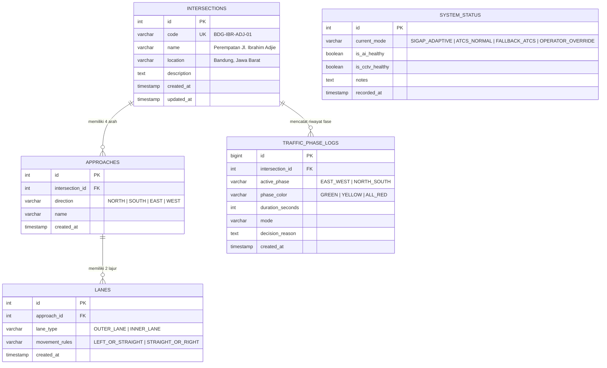

# Entity Relationship Diagram (ERD) - SIGAP Database

Dokumen ini menjelaskan rancangan skema basis data PostgreSQL untuk prototype sistem **SIGAP** (Sistem Pendukung Keputusan Pengaturan Fase Lampu Lalu Lintas Adaptif) pada Perempatan Jl. Ibrahim Adjie - Mall Tenth Avenue, Bandung.

---

## 1. Diagram ERD (Mermaid)

---

## 2. Penjelasan Entitas & Batasan Desain

1. **`intersections`**: Menyimpan identitas simpang fisik yang disimulasikan.
2. **`approaches`**: Merepresentasikan empat arah masuk simpang (Barat, Utara, Timur, Selatan).
3. **`lanes`**: Merepresentasikan dua lajur per arah (Lajur Luar: belok kiri / lurus; Lajur Dalam: lurus / belok kanan).
4. **`system_status`**: Mencatat status operasional aktif dan kondisi kesehatan komponen (AI, kamera, koneksi) untuk memicu logika fallback simulasi.
5. **`traffic_phase_logs`**: Menyimpan riwayat perubahan fase lampu (Hijau $\rightarrow$ Kuning $\rightarrow$ Semua Merah $\rightarrow$ Hijau) beserta alasan pengambilan keputusan untuk perbandingan evaluasi mode adaptif vs normal.

> [!IMPORTANT]
> **Privasi & Regulasi:**
> Skema database **TIDAK** menyimpan nomor plat kendaraan, gambar wajah, maupun ID pelacakan (*tracking ID*). Sistem hanya berfokus pada agregasi jumlah kendaraan dalam antrean.
