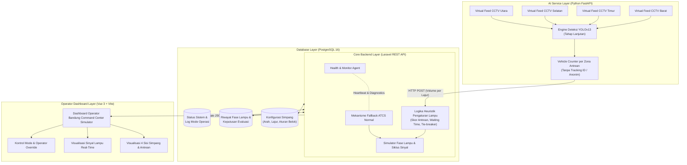
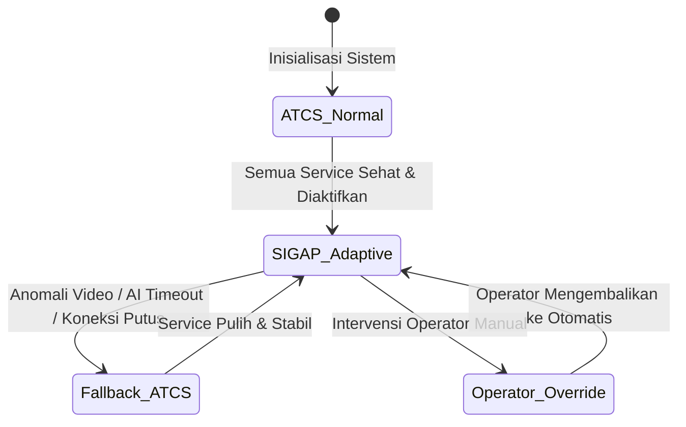

# Arsitektur Sistem SIGAP (Sistem Pengaturan Fase Lampu Adaptif)

Dokumen ini menjelaskan arsitektur teknis, alur data, pembagian tanggung jawab modul, konsep keandalan (*fallback*), serta batasan prototype sistem **SIGAP** pada Perempatan Jl. Ibrahim Adjie - Mall Tenth Avenue, Bandung.

---

## 1. Posisi Sistem: Modul Pendukung ATCS, Bukan Pengganti Controller Fisik

> [!IMPORTANT]
> **Batasan Operasional Utama:**
> SIGAP **bukan** pengganti sistem ATCS (*Area Traffic Control System*) fisik Bandung Command Center dan **tidak terhubung langsung** ke controller lampu lalu lintas asli di lapangan. SIGAP diposisikan murni sebagai **modul pendukung / modul riset pengembangan** ATCS adaptif.

Pada tingkat prototype, seluruh interaksi dengan sistem ATCS Bandung Command Center diwujudkan dalam bentuk:
- **Simulator Mode Operasi**: mensimulasikan mode adaptif, mode normal fixed-time, dan mode intervensi operator.
- **Simulator Fase Lampu**: mensimulasikan siklus perubahan sinyal lampu (Hijau $\rightarrow$ Kuning $\rightarrow$ Semua Merah $\rightarrow$ Hijau fase berikutnya).

---

## 2. Diagram Arsitektur Komponen

---

## 3. Pembagian Peran dan Tanggung Jawab

| Komponen | Teknologi | Tanggung Jawab Utama |
| :--- | :--- | :--- |
| **Frontend** | Vue 3 + Vite | Menangani murni dashboard visualisasi operator, status konektivitas, monitor 4 arah CCTV, dan simulator tombol kendali operator override. |
| **Backend Utama** | Laravel REST API | Menangani manajemen API, konfigurasi geometrik simpang, penyimpanan database, logika heuristik penentuan fase, siklus transisi lampu, status operasional, dan pemicu *fallback*. |
| **AI Service** | Python FastAPI | Khusus menangani pembacaan video stream, inferensi deteksi kendaraan (YOLOv13), penghitungan kendaraan per zona antrean tanpa tracking ID, dan agregasi data ke backend. |
| **Database** | PostgreSQL 16 | Menyimpan konfigurasi statis simpang (4 lengan, 2 lajur masuk/lengan), log kesehatan sistem, serta riwayat perubahan fase dan metrik evaluasi ATCS normal vs adaptif. |
| **Simulator ATCS** | Internal Backend Logic | Mensimulasikan siklus lampu *fixed-time* konvensional dan transisi antar-fase standar (Hijau $\rightarrow$ Kuning $\rightarrow$ Semua Merah). |

---

## 4. Alur Data (*End-to-End Data Flow*)

1. **Pengambilan Input Video (Tahap Lanjutan):**
   - 4 input video CCTV mewakili arah Utara, Selatan, Timur, dan Barat (sisi Mall Tenth Avenue).
2. **Analisis Komputasi Visual (FastAPI):**
   - Frame dianalisis untuk mendeteksi 6 kelas target: motor, mobil, bus, truk, ambulans, dan mobil pemadam.
   - Sistem mendeteksi kendaraan yang berada di dalam poligon **zona antrean** (*queue zone*) pada masing-masing lajur (lajur luar dan lajur dalam).
   - Sistem **TIDAK** menggunakan *vehicle tracking*, tidak membaca plat nomor, dan tidak mengenali wajah.
3. **Pengiriman Hasil Analisis ke Backend:**
   - FastAPI mengirimkan payload berisi jumlah kendaraan per arah dan per lajur ke endpoint Laravel.
4. **Eksekusi Logika Heuristik (Laravel):**
   - Backend memproses jumlah kendaraan, waktu tunggu fase (*waiting time*), dan lama fase tidak hijau.
   - Backend menghitung skor prioritas antara fase Barat-Timur versus Utara-Selatan.
   - Jika skor sama, keputusan diselesaikan melalui *tie-breaker* berjenjang (waktu tunggu terlama $\rightarrow$ siklus bergantian normal).
5. **Simulasi Transisi Sinyal:**
   - Sinyal berubah sesuai urutan keselamatan lalu lintas: Hijau aktif $\rightarrow$ Kuning (3s) $\rightarrow$ Semua Merah (*All-Red* 2s) $\rightarrow$ Hijau fase berikutnya.
6. **Visualisasi Operator (Vue 3):**
   - Dashboard menampilkan status simpang, diagram fase, dan metrik perbandingan.

---

## 5. Konsep Keandalan & Mekanisme *Fallback* ke ATCS Normal

Sistem mengadopsi 4 mode operasional:

- **SIGAP Adaptive Active:** Rekomendasi durasi hijau adaptif dijalankan berdasarkan densitas antrean aktual.
- **ATCS Normal Operation:** Berjalan pada siklus *fixed-time* terjadwal standar.
- **Fallback ke ATCS:** Jika FastAPI tidak merespons (*heartbeat timeout*), stream CCTV terputus, atau data anomali terdeteksi, sistem secara instan beralih ke mode ATCS Normal demi keselamatan persimpangan (*fail-safe principle*).
- **Operator Override:** Operator Bandung Command Center dapat mengunci fase secara manual kapan pun diperlukan.

---

## 6. Batasan Prototype Mata Kuliah

1. **Bukan Pengendali Fisik Lapangan:** Tidak ada kabel atau protokol kontroler lampu (misal NTCIP/SCATS) yang terhubung ke perangkat keras lalu lintas Dishub.
2. **Simulasi Tertutup:** Input video bersumber dari rekaman video uji coba lokal atau simulasi loop video, bukan RTSP resmi Dishub Bandung.
3. **Privasi Total:** Tidak ada pengenalan identitas pengendara, wajah, atau nomor registrasi kendaraan bermotor (NRKB).
4. **Geometri Tetap:** Konfigurasi geometrik simpang dibatasi pada Perempatan Jl. Ibrahim Adjie (4 arah, masing-masing 2 lajur masuk).
